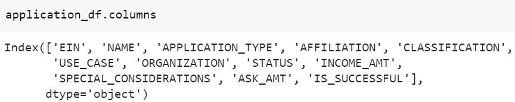
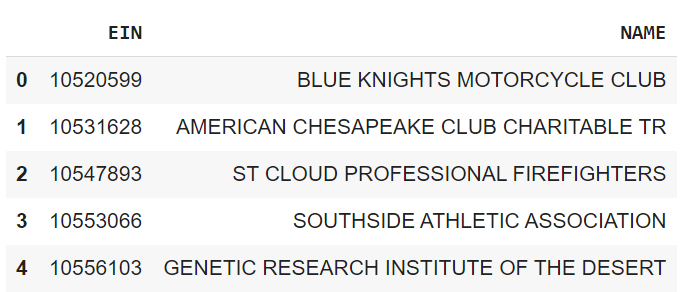
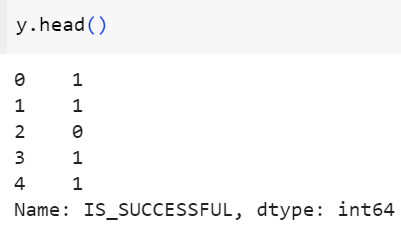
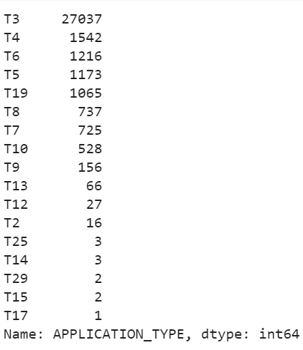
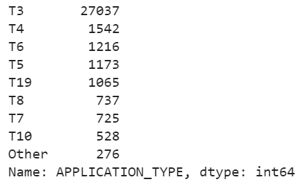
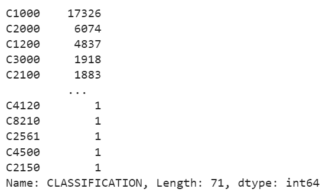
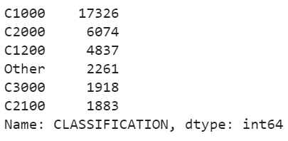
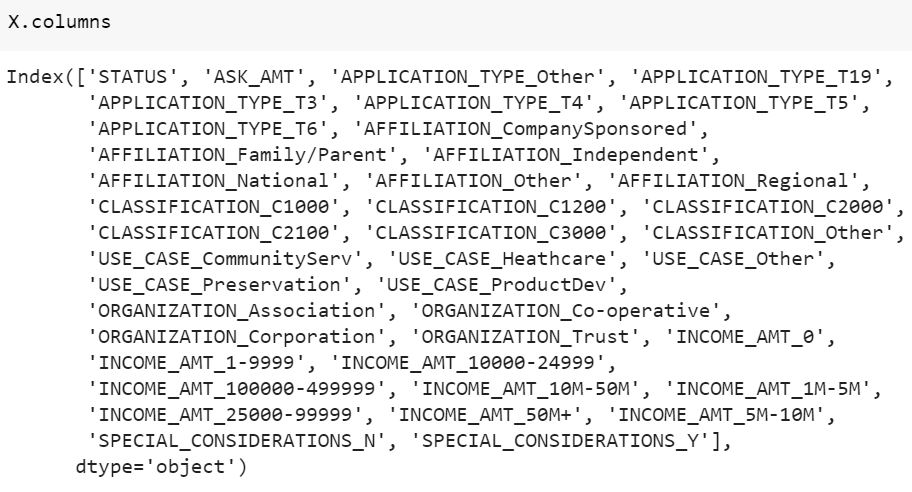

# Report on the Neural Network

## Overview:
The purpose of this analysis is to create a tool that can help a non-profit organization to select the applicants for funding with the best chance of success in their ventures. 

## Results
### Data Preprocessing
Original Dataframe has the following columns:

- The identity columns "EIN","NAME" from the original dataframe are removed.

    

- **Target:** y is the target variable. It has the column "IS_SUCCESSFUL"

    

- **Features:** X has the features. Binning is done for the APPLICATION_TYPE and CLASSIFICATION columns. 

    *APPLICATION_TYPE - before and after binning*

     
    

    *CLASSIFICATION - before and after binning*

      

    The categorical data from the original dataframe are modified to binary data. After all these data preprocessing, the features used are shown below:

    

### Compiling, Training, and Evaluating the Model

- Details of the model used:
    * Hidden Layers - 2
    * Number of neurons - Layer1 - 80, Layer2 - 30
    * Activation function - Hidden layers - relu, Output layer - sigmoid
    * Prediction Accuracy - 72.5%

- Couldn't achieve the target model performance of > 75%

- Optimization Attempts:
    * Attempt 1 - used tanh as the activation function instead of relu in the 2 hidden layers.
    * Attempt 2 - added 3rd hidden layer with 30 neurons and relu as activation function in all 3 layers.
    * Attempt 3 - Updated the features - Dropped "STATUS" and "SPECIAL_CONSIDERATIONS" columns and modified the binning for "APPLICATION_TYPE". Increased the number of neurons in layer 2 to 50.

    **During optimization, the prediction accuracy slightly changed to 72.6%, 72.7%.**

## Summary
To summarize, the neural network model creates a binary classifier that can predict whether the applicants will be successful if funded, at a prediction accuracy of **73%**

If we have to try differently, can use Keras functional API because the Keras functional API is a way to create models that are more flexible than the keras.Sequential. The functional API can handle models with non-linear topology, shared layers, and even multiple inputs or outputs.
